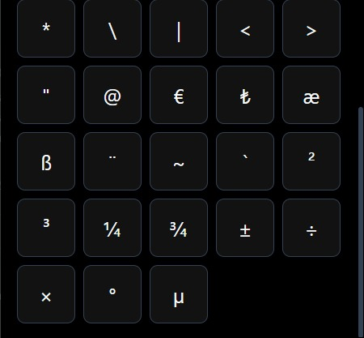
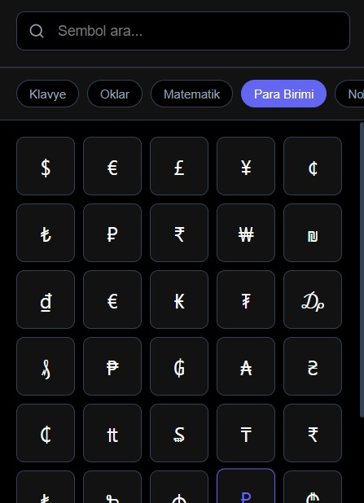
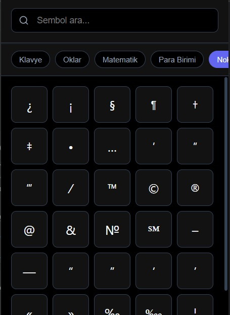

# Type-Assist-For-Chrome
# Yazım Asistanı (Type-Assist) - Chrome Eklentisi / Type-Assist-For-Chrome

 
    &nbsp;&nbsp; &nbsp;&nbsp; &nbsp;&nbsp; 

---

## Eklenti ile alakalı birkaç ekran görüntüsü / A few screenshots related to the extension

    
    
    
    
    
    
    

### ✨ Tek Tıkla Erişilebilen Onlarca Sembol ve Özel Karakter (TR)

Bu basit Chrome eklentisi, klavyenizde kolayca bulamadığınız veya yazmakta zorlandığınız tüm özel sembolleri ve karakterleri (**Tescil®, Telif Hakkı©, Oklar, Matematiksel Semboller, Para Birimleri** vb.) tek bir arayüzde toplar.

* **Anında Kopyalama:** Seçtiğiniz sembolü tek bir tıklama ile panoya kopyalayın.
* **Geniş Kütüphane:** Onlarca yaygın ve nadir kullanılan özel karakter kütüphanesine erişim.
* **Zaman Tasarrufu:** İnternette arama yapmaya veya klavye kombinasyonlarını hatırlamaya gerek kalmaz.

Bu eklenti, teknik belgeler, sosyal medya gönderileri ve sunumlar hazırlarken büyük bir kolaylık sağlar.

---

### ✨ Dozens of Symbols and Special Characters Accessible with One Click (EN)

This simple Chrome extension gathers all special symbols and characters that you can't easily find or type on your keyboard (**Trademark®, Copyright©, Arrows, Mathematical Symbols, Currencies**, etc.) into a single interface.

* **Instant Copy:** Copy the selected symbol to the clipboard with a single click.
* **Extensive Library:** Access a library of dozens of common and rare special characters.
* **Time Saving:** No need to search the internet or remember complex keyboard shortcuts.

This extension provides great convenience when preparing technical documents, social media posts, and presentations.

---

### 💻 Proje Teknolojileri: / Project Technologies:

    

💡 **Eklenecekler / To Be Added**: Chrome Extensions sayfasına eklenecek ve link readme. dosyasına eklenecek. Eğer Web sayfasına yüklenmeden kullanmak istiyorsanız gerekli konfigürasyon ayarları ile yerel bir şekilde kullanabilirsiniz.

---
